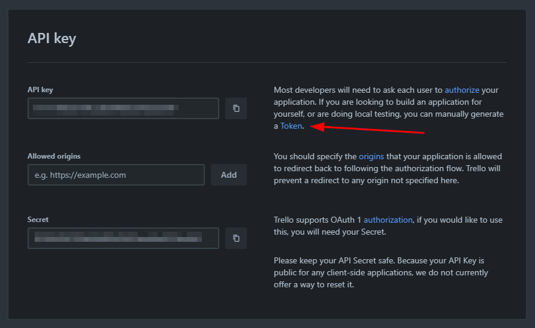
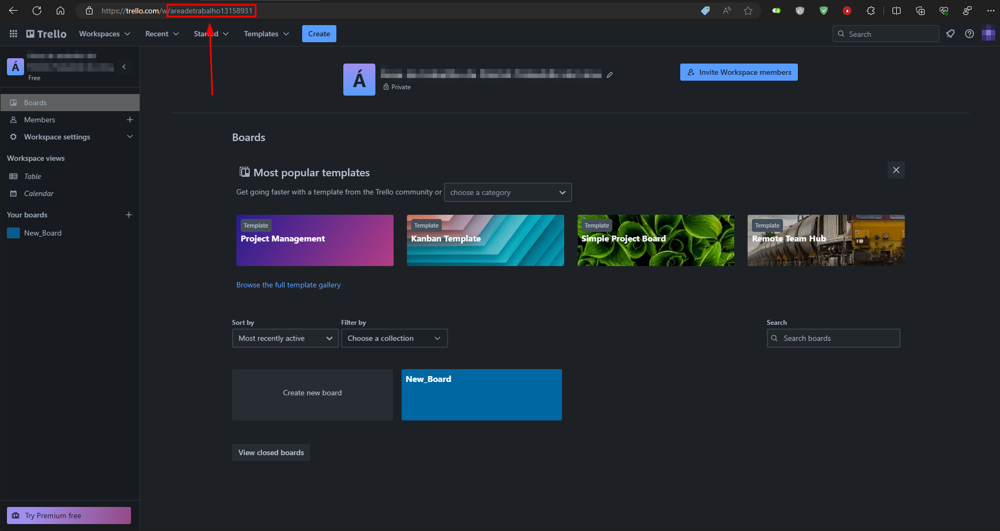

## Workspace (Área de Trabalho)
Necessário para poder gerar a chave de Api

## Cypress.env.json
Alguns valores devem ser inseridos no arquivo Cypress.env.json
Os valores são:
- key (Chave da API)
- token
- organizationName
- organizationDisplayName

### Key (Chave da Api)
a chave da API "key" obtida através da URL: https://trello.com/power-ups/admin

### Token
O token é gerado a partir da chave de API, o mesmo deve ser acessado através do link TOKEN

### Organization Name
O organizationName é obtido na URL da área de trabalho Trello

### OrganizationDisplayName
O organizationDisplayName é efetivamente o nome da área de trabalho como está escrito

# Mapa Mental
https://miro.com/welcomeonboard/dzJUTHZvYVZWM1k4WGRUM1BFeDIyQnZtRm5PbWFjZWQ3TnM4azgxdGdFSllVYkh6SDdPSjJsVm84UDdGbHQwMXwzNDU4NzY0NTE3OTE2ODUxNDM1fDI=?share_link_id=926832534172